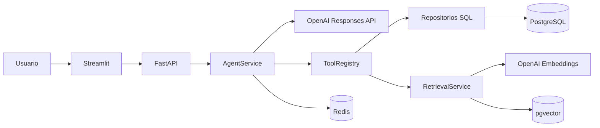
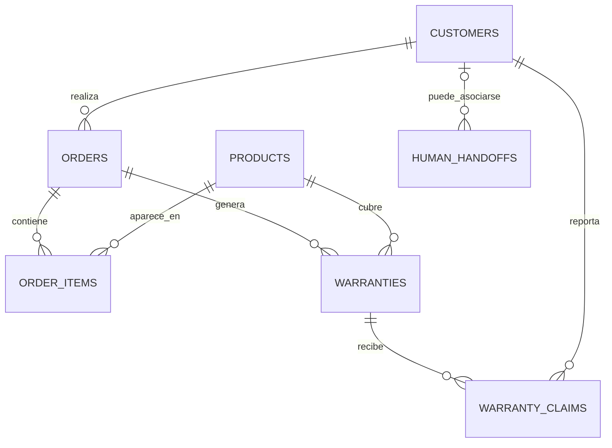

# Prueba técnica: agente IA para atención retail

Solución desarrollada para automatizar la atención de una tienda de productos electrónicos. El
agente puede acompañar al cliente desde una consulta comercial hasta procesos de postventa, usando
información real del sistema y herramientas controladas en lugar de inventar respuestas.

La entrega incluye una API en FastAPI, una interfaz conversacional en Streamlit, persistencia en
PostgreSQL, memoria de sesión en Redis y búsqueda semántica con pgvector.

## Objetivo de la solución

El objetivo principal fue construir un agente capaz de resolver tres escenarios de negocio:

1. Recomendar y comparar productos según la necesidad y el presupuesto del usuario.
2. Consultar pedidos de forma segura, validando primero al cliente.
3. Consultar garantías, registrar reclamos y escalar casos que necesiten atención humana.

Como alcance adicional se implementaron registro de clientes, actualización de direcciones,
consulta de políticas mediante RAG y transferencia general a un asesor.

## Alcance entregado

| Área | Implementación |
|---|---|
| Venta consultiva | Búsqueda por categoría, presupuesto, uso y especificaciones; comparación por SKU. |
| Clientes | Consulta por identificación y registro con validación de nombre, teléfono y correo. |
| Pedidos | Listado, consulta individual y actualización controlada de dirección. |
| Garantías | Validación de cobertura por pedido y producto. |
| Reclamos | Creación de ticket, prevención de duplicados y consulta de estado. |
| Atención humana | Escalamiento de reclamos y transferencia general de conversaciones. |
| Base de conocimiento | Recuperación semántica de políticas, preguntas frecuentes y guías. |
| Memoria | Persistencia del historial y del estado del flujo en Redis. |
| Interfaz | Chat web en Streamlit conectado a la API. |
| Infraestructura | Entorno reproducible con Docker Compose. |

## Cómo evaluar la prueba

### Requisitos

- Docker Engine.
- Docker Compose v2.
- Una API key de OpenAI con acceso al modelo conversacional y al modelo de embeddings.

### Puesta en marcha

1. Crea el archivo de configuración:

   ```bash
   cp .env.example .env
   ```

2. Agrega la credencial en `.env`:

   ```dotenv
   OPENAI_API_KEY=tu_api_key
   ```

3. Construye e inicia la solución:

   ```bash
   docker compose up --build
   ```

4. Abre la interfaz:

   - Chat: http://localhost:8501
   - API: http://localhost:8000
   - Swagger: http://localhost:8000/docs

Durante el primer arranque, PostgreSQL crea el esquema y carga los datos de demostración. Después,
el servicio `knowledge-ingestion` genera los embeddings pendientes. La API inicia cuando este
proceso termina correctamente.

## Escenarios de demostración

Los siguientes casos permiten revisar los flujos principales sin preparar información adicional.
Todos los clientes, pedidos y productos son datos ficticios.

### 1. Venta consultiva

Mensaje inicial:

```text
Necesito un portátil para diseño gráfico, con 16 GB de RAM y un presupuesto máximo de 5 millones.
```

Después:

```text
Compara las dos mejores opciones.
```

Resultado que se busca comprobar:

- El agente consulta el catálogo antes de responder.
- Respeta el presupuesto y la disponibilidad.
- Presenta información obtenida desde PostgreSQL.
- Explica ventajas y diferencias sin asumir que el producto más costoso es el mejor.

### 2. Consulta de pedido

```text
Quiero consultar el estado del pedido ORD-1001.
```

Cuando el agente solicite identificación, usa:

```text
1020304050
```

Resultado que se busca comprobar:

- La identificación se valida antes de consultar información privada.
- El número de identificación no se envía como argumento libre desde el modelo a la herramienta.
- El pedido se consulta junto con el cliente para impedir acceso a pedidos ajenos.
- El agente informa estado y fecha estimada sin inventar datos.

### 3. Cambio de dirección

```text
Quiero cambiar la dirección del pedido ORD-1010 a Calle 20 # 15-30, Pereira.
```

Identificación de prueba:

```text
33445566
```

El pedido está en estado `PREPARING`, por lo que permite el cambio. La aplicación rechaza la
operación cuando el pedido ya fue enviado, entregado o cancelado.

### 4. Garantía y creación de reclamo

```text
Quiero revisar la garantía del pedido ORD-1002.
```

Usa la identificación:

```text
987654321
```

El pedido tiene dos productos con garantía. Para probar la creación de un reclamo nuevo, selecciona:

```text
AUD-SON-001
```

Después describe una falla concreta, por ejemplo:

```text
El parlante se apaga después de unos minutos aunque esté completamente cargado.
```

Resultado que se busca comprobar:

- El agente solicita elegir un producto cuando el pedido contiene varias garantías.
- La cobertura se valida antes de registrar el caso.
- El problema reportado no es completado ni modificado por el agente.
- Se genera un número de ticket.
- Si ya existe un reclamo activo, se recupera el existente en lugar de crear otro.

### 5. Base de conocimiento

```text
¿Cuánto tarda un envío a una ciudad principal?
```

Resultado que se busca comprobar:

- El agente usa búsqueda semántica sobre `kb_chunks`.
- La respuesta proviene de los fragmentos recuperados.
- Si no existe información suficientemente relevante, el agente lo indica y no completa la
  respuesta con conocimiento externo.

### 6. Atención humana

```text
Quiero hablar con un asesor.
```

Este flujo no requiere identificación. La solicitud queda asociada a la sesión y no se duplica si
el usuario vuelve a pedir un asesor mientras existe una atención activa.

## Decisiones técnicas

### Arquitectura por capas

La solución separa dominio, aplicación, infraestructura e interfaces. Las reglas de negocio no
dependen directamente de FastAPI, SQLAlchemy, Redis u OpenAI.

```text
app/
├── domain/          Entidades, objetos de valor y reglas del negocio
├── application/     Casos de uso, DTO, herramientas, puertos y prompt
├── infrastructure/ PostgreSQL, Redis, OpenAI, pgvector y configuración
└── interfaces/      API, esquemas HTTP, middleware e inyección de dependencias
```

Los servicios trabajan con puertos y los adaptadores concretos se conectan en
`app/interfaces/api/deps.py`. Esto permite reemplazar un repositorio o proveedor sin trasladar sus
detalles al dominio.

### Uso controlado de herramientas

El modelo no consulta directamente la base de datos. Solicita herramientas registradas en
`ToolRegistry`, cuyos argumentos son validados con modelos Pydantic antes de ejecutarse.

Las herramientas cubren:

- Catálogo y comparación.
- Identificación y registro de clientes.
- Consulta y modificación de pedidos.
- Garantías y reclamos.
- Atención humana.
- Búsqueda en la base de conocimiento.

Se limita la cantidad de rondas de herramientas por interacción mediante
`AGENT_MAX_TOOL_ROUNDS`.

### Seguridad de la información del cliente

La identificación validada se conserva dentro del estado de la sesión. Las herramientas privadas
de pedidos, garantías y escalamiento obtienen al cliente desde ese contexto; el modelo no puede
enviar una identificación arbitraria para consultar datos.

Los repositorios también filtran por recurso y cliente en la misma consulta. Si un pedido o ticket
pertenece a otra persona, la aplicación responde como no encontrado y no confirma su existencia.

### Memoria conversacional

Redis conserva:

- Historial de mensajes.
- Estado de identificación del cliente.
- Datos parciales de registro.
- Acción que debe retomarse después de la verificación.
- Referencias temporales de pedidos, garantías y tickets.

Cada conversación utiliza un UUID como `session_id`. Su duración se configura con
`REDIS_SESSION_TTL_SECONDS`.

### RAG con PostgreSQL y pgvector

La base de conocimiento se almacena en `kb_chunks`. Cada fragmento tiene contenido, fuente,
metadatos y un embedding de 1536 dimensiones.

El flujo de recuperación:

1. Convierte la consulta en un embedding.
2. Ejecuta una búsqueda por distancia coseno en pgvector.
3. Convierte la distancia en un puntaje de similitud.
4. Aplica un umbral mínimo y un margen respecto al mejor resultado.
5. Entrega al agente únicamente los fragmentos aceptados.

El margen adaptativo ayuda a tolerar consultas con errores de escritura sin mezclar contenido de
temas poco relacionados.

## Arquitectura general



Flujo de una interacción:

1. FastAPI recibe el mensaje y crea o reutiliza el `session_id`.
2. `AgentService` recupera la conversación desde Redis.
3. El proveedor LLM recibe el historial, las instrucciones y las herramientas disponibles.
4. Si el modelo solicita una herramienta, la aplicación valida y ejecuta la operación.
5. El resultado vuelve al modelo para construir la respuesta final.
6. La conversación actualizada se guarda nuevamente en Redis.

## Modelo de datos

El diagrama completo está disponible en
[`modelado_datos/model_datos.mmd`](modelado_datos/model_datos.mmd).



Aspectos relevantes del modelado:

- `order_items` conserva los productos, cantidades y precios registrados en cada compra.
- La combinación de pedido y producto es única tanto en líneas de pedido como en garantías.
- El identificador de `warranty_claims` funciona también como número de ticket.
- `human_handoffs.customer_id` es opcional porque una conversación puede escalarse antes de
  identificar al usuario.
- Un índice parcial permite solamente un handoff activo por sesión.
- `session_id` relaciona lógicamente el handoff con Redis, pero no es una clave foránea porque las
  conversaciones no se almacenan en PostgreSQL.
- `kb_chunks` permanece separado de las tablas transaccionales.

## Datos incluidos para la evaluación

`database/init.sql` crea y carga:

- 54 productos.
- 10 clientes.
- 15 pedidos.
- 23 líneas de pedido.
- 12 garantías.
- 5 reclamos en distintos estados.
- Fragmentos iniciales de políticas y preguntas frecuentes.

Casos útiles:

| Identificación | Pedido | Uso sugerido |
|---|---|---|
| `1020304050` | `ORD-1001` | Pedido en tránsito y garantía vigente. |
| `987654321` | `ORD-1002` | Pedido entregado con dos productos cubiertos. |
| `33445566` | `ORD-1010` | Pedido modificable en estado `PREPARING`. |
| `77889900` | `ORD-1011` | Garantía vencida. |
| `11223344` | `ORD-1007` | Reclamo previamente escalado. |

## API

| Método | Ruta | Descripción |
|---|---|---|
| `GET` | `/` | Información básica del servicio. |
| `GET` | `/health` | Verifica que la API esté disponible. |
| `GET` | `/health_database` | Verifica la conexión con PostgreSQL. |
| `POST` | `/chat` | Procesa un mensaje del usuario. |
| `GET` | `/docs` | Documentación interactiva. |

Ejemplo:

```bash
curl -X POST http://localhost:8000/chat \
  -H "Content-Type: application/json" \
  -d '{
    "message": "Busco un portátil para diseño gráfico por menos de 5 millones"
  }'
```

Respuesta:

```json
{
  "session_id": "3a38a55e-a9ad-4d58-86a7-63b106a62e8c",
  "reply": "..."
}
```

Para continuar la conversación se debe enviar el mismo `session_id` en las solicitudes siguientes.

## Ejecución local

Este modo mantiene PostgreSQL y Redis en Docker, pero ejecuta la API y el frontend en la máquina:

```bash
uv sync
docker compose up -d db redis
uv run python -m app.scripts.ingest_knowledge
uv run uvicorn app.main:app --reload
```

En otra terminal:

```bash
uv run streamlit run frontend/streamlit_app.py
```

La conexión local predeterminada usa PostgreSQL en el puerto `5433` y Redis en el puerto `6379`.

## Configuración

Las variables se encuentran documentadas en `.env.example`. Las más importantes para evaluar la
solución son:

| Variable | Propósito |
|---|---|
| `OPENAI_API_KEY` | Credencial requerida para chat y embeddings. |
| `OPENAI_MODEL` | Modelo conversacional. |
| `OPENAI_REASONING_EFFORT` | Nivel de razonamiento solicitado al modelo. |
| `OPENAI_MAX_OUTPUT_TOKENS` | Límite de tokens por respuesta. |
| `AGENT_MAX_TOOL_ROUNDS` | Máximo de rondas de herramientas. |
| `DATABASE_URL` | Conexión local a PostgreSQL. |
| `REDIS_URL` | Conexión al almacenamiento de sesiones. |
| `REDIS_SESSION_TTL_SECONDS` | Tiempo de vida de la conversación. |
| `EMBEDDING_MODEL` | Modelo usado para búsqueda semántica. |
| `EMBEDDING_DIMENSIONS` | Dimensión del vector, actualmente `1536`. |
| `KNOWLEDGE_SCORE_THRESHOLD` | Similitud mínima aceptada. |
| `KNOWLEDGE_SCORE_MARGIN` | Diferencia permitida respecto al mejor resultado. |

La dimensión configurada debe coincidir con OpenAI, `KnowledgeChunkModel` y la columna
`kb_chunks.embedding`.

## Validaciones ejecutadas

Comandos disponibles para revisar la entrega:

```bash
uv run pytest
uv run ruff check .
uv run pyrefly check
```

Estado al preparar esta documentación:

- Pruebas: `1 passed`.
- Ruff: sin errores.
- Pyrefly: `0 errors`.
- Docker Compose: configuración válida para `db`, `redis`, `knowledge-ingestion`, `app` y
  `frontend`.

La prueba automatizada actual cubre el endpoint de salud. Los servicios de recuperación, herramientas
y repositorios tienen una estructura preparada para ampliar pruebas unitarias y de integración.

## Estructura de la entrega

```text
.
├── app/                       Código principal por capas
├── database/init.sql          Esquema y datos de demostración
├── frontend/streamlit_app.py  Interfaz conversacional
├── knowledge/                 Documentos de soporte
├── modelado_datos/            Diagrama entidad-relación
├── tests/                     Pruebas automatizadas
├── .env.example               Plantilla de configuración
├── docker-compose.yml         Orquestación del entorno
├── Dockerfile                 Imagen de la API
├── Dockerfile.frontend        Imagen de Streamlit
└── pyproject.toml             Dependencias y herramientas de calidad
```

## Limitaciones y trabajo futuro

La entrega prioriza los flujos solicitados y una separación clara de responsabilidades. Para llevar
la solución a producción todavía sería necesario:

- Implementar autenticación real; la identificación conversacional no reemplaza una sesión
  autenticada.
- Administrar el esquema mediante migraciones. Alembic está incluido, pero el entorno actual se
  inicializa desde `database/init.sql`.
- Incorporar pruebas unitarias e integración para todos los repositorios y herramientas.
- Añadir métricas, trazas distribuidas y alertas.
- Gestionar secretos mediante un servicio especializado.
- Crear una interfaz administrativa para asignar y cerrar solicitudes de atención humana.
- Persistir o reconstruir en el frontend el historial visible al abrir una sesión desde otro
  navegador.

Estas decisiones se dejaron fuera para mantener el alcance centrado en la prueba técnica y en los
escenarios funcionales evaluables.
